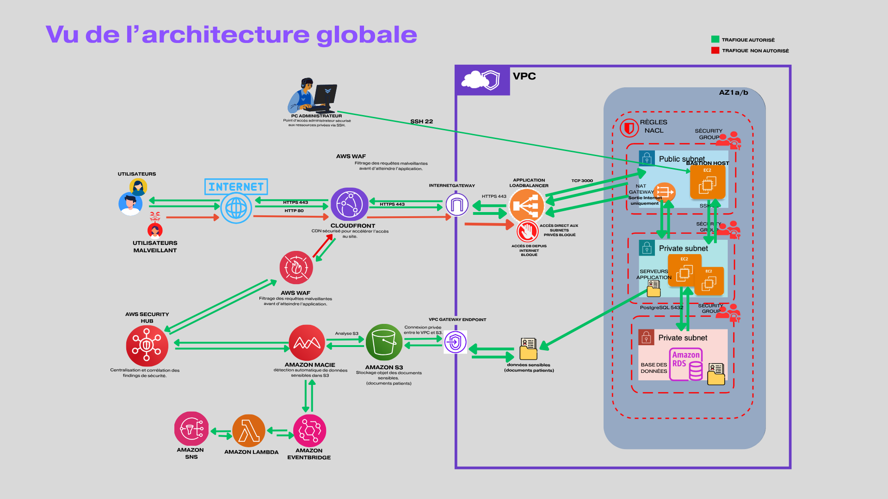

# 🔐 Doctolab - AWS Cloud Security Architecture

## 📌 Overview
## 📸 Architecture

Doctolab is a cloud security project simulating a healthcare application 
handling sensitive patient data (PII).

The objective is to design a secure AWS architecture capable of:
- protecting resources
- detecting sensitive data exposure
- centralizing security findings
- triggering automated alerts

---

## 🏗️ Architecture

- CloudFront + AWS WAF → protection against web attacks (SQLi, XSS)
- VPC (public/private subnets) → network segmentation
- Bastion Host → secure admin access
- EC2 (private) → application layer
- RDS PostgreSQL → private database (no internet access)
- S3 → storage of sensitive documents
- NAT Gateway + VPC Endpoint → controlled network access

---

## 🔐 Security Approach

This project implements a **defense-in-depth strategy**:

- Web protection (WAF)
- Network isolation (VPC, SG, NACL)
- Data protection (S3, RDS)
- Detection (Macie)
- Centralization (Security Hub)
- Automation (EventBridge, Lambda, SNS)

---

## 🚨 Detection & Alerting Pipeline

1. Sensitive data uploaded to S3
2. Amazon Macie detects sensitive content
3. EventBridge triggers a rule
4. Lambda processes the finding
5. SNS sends a human-readable alert

---

## 🛡️ Security Tests

Simulated attacks:
- SQL Injection → blocked by WAF
- XSS → blocked by WAF

---

## ⚡ Results

- Automated detection of sensitive data
- Reduced incident response time (MTTR)
- Centralized security visibility
- Real-time alerting

---

## 🧰 Technologies Used

- AWS (CloudFront, WAF, VPC, EC2, RDS, S3)
- Amazon Macie
- AWS Security Hub
- EventBridge
- Lambda
- SNS
- CloudFormation (Infrastructure as Code)

---

## 📎 Documentation

Full project report available in `/report`

---

## 🚀 Author

Cloud Security enthusiast  
Goal: Become AWS Cloud Security Architect
